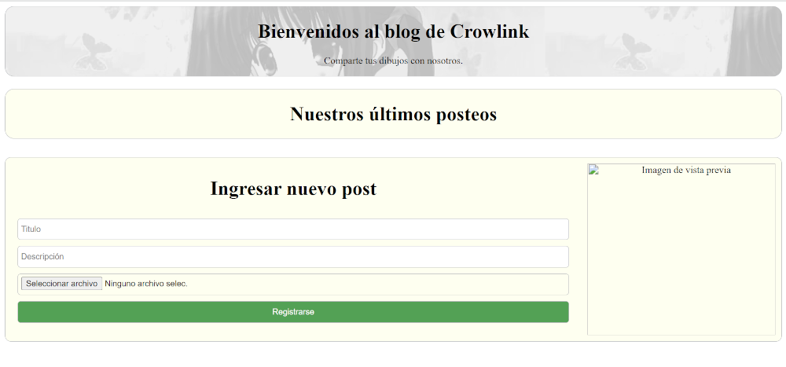

# PROYECTO 2: Aplicación CRUD

## **ÍNDICE**

* [1. Intro](#1-intro)
* [2. CRUD](#2-demo)

****

## 1. Intro

Se creo una página para ingresar post. Esta permite ingresar un titulo, una descripcion y una imagen que se guarda en base64 (texto)

****

## 2. CRUD

En la parte inferior se creo el mantenedor de post donde se ingresan los datos necesarios y un boton para guardar la información en localstorage.
Cada post crea una tarjeta con los datos y 2 botones: una para modificar y el otro para eliminar los datos

****